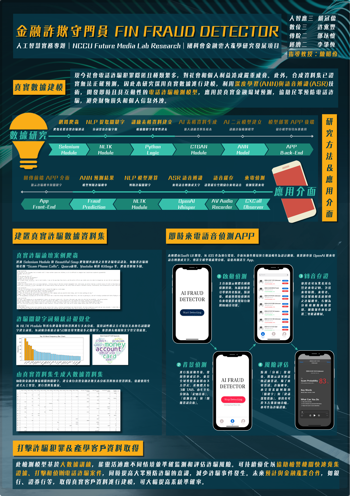

# AI Fin Fraud Detector

> Please refer to the README.md in the "Code" folder to see the detail experiment processes and results.

The goal of this project is to create an AI fraud detector app to prevent middle-aged and elderly people from suffering telephone fraud, reducing criminal behavior and financial losses instantly.

1. **Artificial intelligence usage**: 
   - **Data Collection("Data" Folder)**:  In order to ensure the accuracy of judgment, we use the content of real fraud calls as the criteria for keyword selection, and crawl real fraud phone information from foreign forums through SeleniumModule and BeautifulSoup, such as the fraud discussing community "SEamPhoneCalls", Ruura Forum , Yuutube channel Kittoga, etc.
   - **Natural Language Processing("Code" Folder/NLP - Words Frequency Counting.ipynb)**:  NLTK Module conducts text analysis on all data obtained by crawlers, using part-of-speech tagging to extract the noun keywords of the text and creates word bags, and applies Counter function to perform word frequency analysis and count the top 50 most frequently occurring keywords. The results are presented through bar chart and word cloud.
   - **Initial Training Dataset Building(Keyword training data frame.ipynb)**:  The word frequency statistical results mainly include five categories according to high word frequency keywords: money related, personal information related, inducement words related, promotional content related, and kinship related. Among them, the money related category is the most important in financial fraud detection, its weight is higher than other categories, and the frequency of keywords in this category is higher than other categories. Therefore, it'll be dealt with first.
      - The keywords in this category are individually extracted to create collumns from "Money related 1" to "Money related 9". Then we conduct text search from "Money related 1" to "Money related 9" in order of keyword frequency (money, card, credit, bank, insurance, taxes, bill, dollars, warrant). When traversing each keyword, we use Python "str.contains" method to obtain text data value containing the keyword and get its corresponding ID value, storing the keyword and ID value separately in the corresponding money related category fields and ID fields of the data table. If the ID field corresponding to the obtained keyword already exists in the data table, it'll be ignored; if the keyword is not found, 0 will be added.
      - For personal information related, inducement words related, promotional content related, and kinship related, we search and fill in the most frequent keyword in each corresponding category fields("Personal information related", "Inducement words related", "Promotional content related", "Kinship related") and ID fields of the data table. If the keyword is not found, 0 will be added.
   - **Missing Values Imputation(Keyword training data frame.ipynb)**: Because the original dataset are built through different ways depending on columns, so the imputation methods are customized separately for both parts.
      - For "Money related 1" to "Money related 9", due to its sparse matrix format, we can't apply normal imputation methods such as mode. Therefore, we first calculate the maximum number of appearing times of non-zero values in each row of data, and the number is 1 (time). Then we take the number as the standard and get the specific rows from dataset, transforming "Money related 1" to "Money related 9" into "Money related"(just 1 column). By this way, we not only avoid applying inappropriate imputation on these columns but also keep real data as much as possible.
      - For personal information related, inducement words related, promotional content related, and kinship related, we use the other three columns to fill the remaining column by neural network. During training, we calculate the accuracy and error rate of the training set and testing set for each epoch, and then select the epoch with the highest accuracy rate as the last used model.
   - **Dataset Amplification(CTGAN.ipynb)**: CTGAN was a Python module developed by researchers at MIT to generate high-quality synthetic tabular data. During training process, the generator tries to fool the discriminator, while the discriminator tries to better identify real data and generated data, and eventually the generator generates synthetic data which is very similar to the real data logic. Therefore, we use CTGAN module to amplify the original dataset, keeping real data as much as possible.

2. **Application front end**:

3. **Application back end**: 
   - **Record Storage("Backend", "Firebase_File" Folder)**: We want to deploy our database on AWS or another cloud service platform, including the analysis results and advice for users. As for phone call records, users can optionally allow us to store them due to data security and privacy concerns.

By achieving these goals, our team looks forward to not only helping people prevent telephone fraud but also assisting police agencies to beat scammers. 

## Contributors
| 組員    | 系級              | 學號       | 職位                     | 工作分配             |
|---------|-------------------|------------|--------------------------|----------------------|
| 賴冠儒  | 廣電四/人智應四   | 110405026  | Project Manager & AI Engineer     | Progress arangement, AI programming |
| 蔡安德  | 統計三            | 110405193  |  AI Engineer               | AI programming |
| 李肇恆  | 經濟三            | 110208063  | AI Engineer               | AI programming, Theses researching |
| Apoorv Saxena  | 已畢業     | NA  | AI Engineer              | AI programming |
| 蘇胤翔  | 資科四     | 110703051  | AI Engineer              | Missing value imputation |
| 許兆豐  | 廣電四/數位四     | 110405027  | APP Designer & Front-end engineer       | APP designing, Front-end programming |
| 簡子策  | 已畢業            | NA  |  APP Front-end engineer               | Front-end programming |
| 邵以懷  | 新聞三            | 111405131  | APP Back-end engineer               | Back-end programming, Theses researching, External liaison |
| 李淳皓  | 資管三/數位三     | 111306020  | APP Back-end engineer               | Back-end programming |

## Project structure(show at most 3 hiararchy)
```
AI Fin Fraud Detector
├─ Code
│  ├─ AI part
│  │  ├─ NLP_Words_Frequency_Counting.ipynb
│  │  ├─ Web Scraping.ipynb
│  │  ├─ Keyword training data frame.ipynb
│  │  ├─ CTGAN.ipynb
│  │  ├─ amplified_result.csv
│  │  └─ heart.png
│  ├─ App/AI_Fraud_Detector
│  │  ├─ .bundle
│  │  ├─ __tests__
│  │  ├─ android
│  │  ├─ ios
│  │  ├─ .eslintrc.js
│  │  ├─ .gitignore
│  │  ├─ .prettierrc.js
│  │  ├─ .watchmanconfig
│  │  ├─ App.tsx
│  │  ├─ Gemfile
│  │  ├─ Gemfile.lock
│  │  ├─ app.json
│  │  ├─ babel.config.js
│  │  ├─ index.js
│  │  ├─ jest.config.js
│  │  ├─ metro.config.js
│  │  ├─ package-lock.json
│  │  ├─ package.json
│  │  ├─ tsconfig.json
│  │  └─ README.md
│  ├─ Backend
│  │  ├─ api
│  │  ├─ middleware
│  │  ├─ node_modules
│  │  ├─ secret
│  │  ├─ app.js
│  │  ├─ firebase.js
│  │  ├─ package-lock.json
│  │  └─ package.json
│  ├─ Frontend
│  │  ├─ Ai Fraud.xcodeproj
│  │  └─ Ai Fraud
├─ Data
│  ├─ scam_records_1.csv
│  ├─ scam_records_2.csv
│  ├─ scam_records_3.csv
│  ├─ scam_records_4.csv
│  └─ scam_records_5.csv
├─ Doc
│  ├─ Project poster.pdf
│  └─ Project proposal.pdf
├─ README.md
└─ teaser.png
```
## Theses References
* Z. L. Liu*, "Legal system-oriented telecom fraud detection, identification and prevention," 2023. Thesis. School of Law, Hebei Finance University.
* Jian-jia Su and Yun-nung Chen, "Modeling Real-Time Call Behaviors for Fraudulent Phone Call Detection," 2019. Thesis. National Taiwan University.
* Johan H van Heerden, "Detecting Fraud in Cellular Telephone Networks," 2005. Thesis. Operational Analysis University of Stellenbosch.
